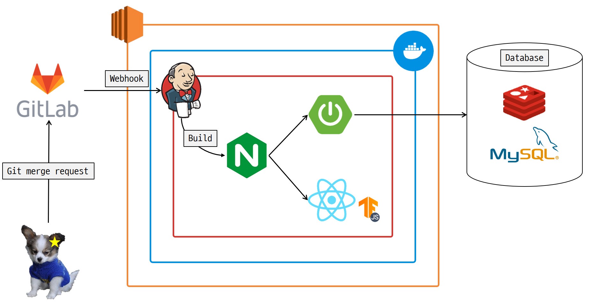
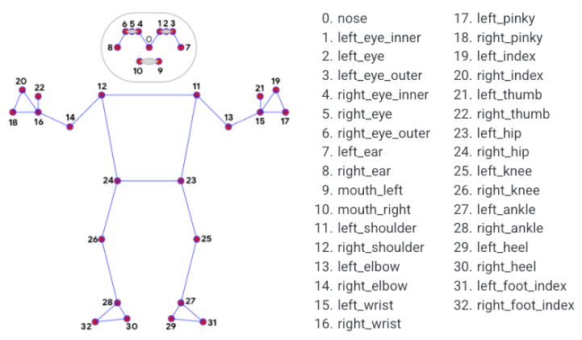
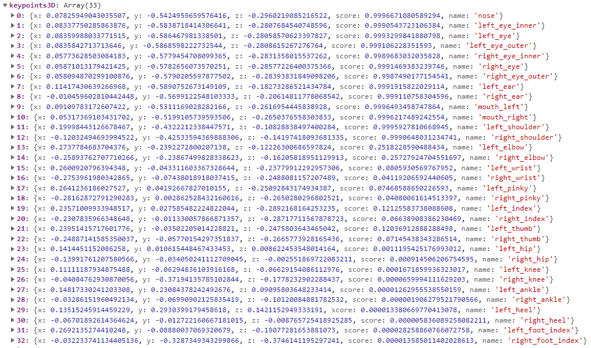
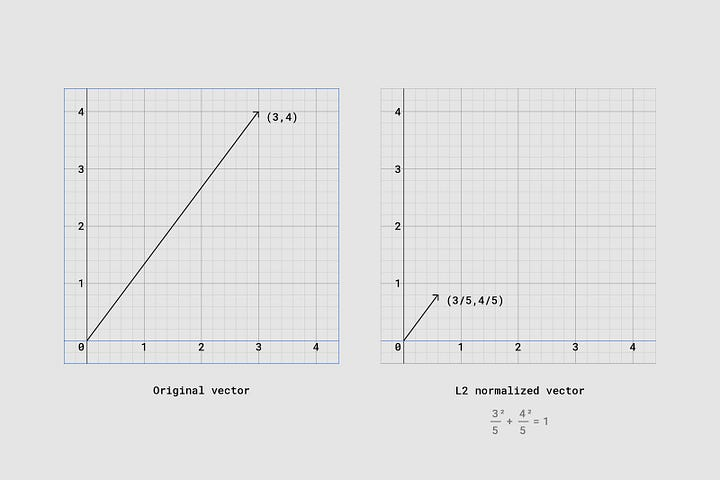
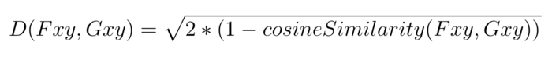
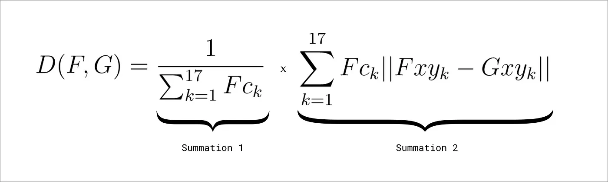
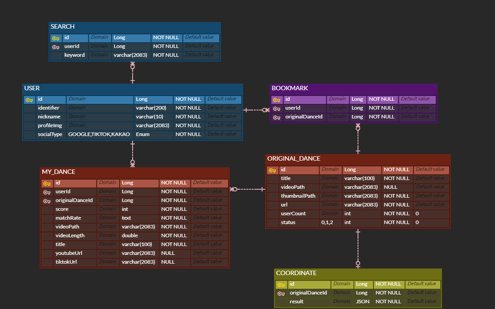
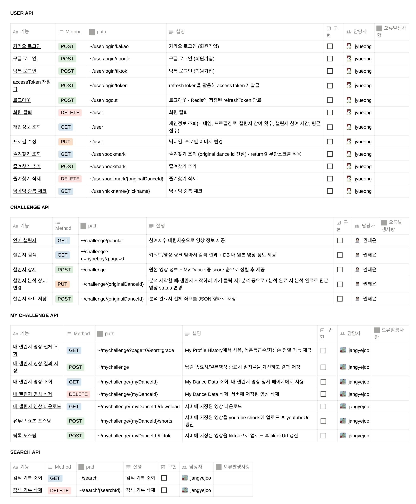

# 프로젝트 README

## 😎 팀명 및 서비스명

- 팀명: **SS501 (SSAFY TEAM A501)**
- 서비스명: **C#OOM (CHOOM, 춤)**

 

## 👨‍👩‍👧‍👦 팀원

- 공예찬 (팀장, Frontend)
- 권태윤 (Backend)
- 김경림 (Frontend)
- 장예주 (Backend)
- 정유정 (Backend)
- 주대선 (AI, Frontend)

 

## 🤔 기획의도

- 틱톡, 유튜브 쇼츠 등의 플랫폼에서 [Hype Boy](https://youtube.com/shorts/Lbirl9EgkDI?feature=share) 등 챌린지 영상이 인기를 끌고 있음
- 일반인들 역시 “스트리트 우먼 파이터”, “스트리트 맨 파이터” 등의 프로그램이나 유튜브 내 K-POP 안무 영상 등을 통해 K-POP, 춤, 챌린지 등에 접근성과 수요가 높음
- 춤 일치율을 이용해 춤/챌린지를 학습할 수 있는 서비스를 제공
- 몸치 탈출, 다이어트 등 다양한 목적 및 관심사로도 어필 가능할 듯
- [저스트댄스](https://justdancenow.com/?lang=ko)처럼 비슷한 성공사례 존재

 

## 📍 기능 개요

- 메인 기능 - 쇼츠를 위한 춤 배우기
- 서브 기능 - 내가 배운거 자랑하는 기능(내 SNS계정, 내가 배운 춤들, 일치율)

 

## 🧱 배포 아키텍쳐

 

## 💾 데이터 플로우

### 0. 전반적인 흐름

- **BlazePose를 이용해서 동작의 keypoints 추출 → 전처리(Resize and Scale, L2 Normalization) → 일치율 계산(Cosine Similarity) → 점수출력**

### 1. BlazePose를 이용해서 동작의 keypoints 추출

- **BlazePose Keypoints: Used in MediaPipe BlazePose**
  
- **실제 keypoints값 예시**
  

### 2. 전처리

<aside>
🚫 영상속 사람의 크기가 다르기 때문에 전처리 과정이 필요

</aside>

- **L2 Normalization: 키포인트의 좌표의 모든 벡터가 단위 norm을 갖게한다**
  
  _A vector scaled with L2 normalization_

### 3. 일치울 계산

- **정규화된 키포인트 좌표를 통해 Cosine Similarity 계산**
  
- **Cosine Similarity + Confidence Score**
  BlazePose를 이용하여 실제 관절이 어디에 있는지 추론할 때, 관절이 어디에 있는지 100% 확신하는 경우는 거의 없습니다. 따라서, 우리는 신뢰도가 낮은 관절이 신뢰도가 높은 관절보다 거리 메트릭에 미치는 영향이 적도록, 관절 데이터에 가중치를 부여할 수 있도록 구글 연구원인 [George Papandreou](https://research.google.com/pubs/GeorgePapandreou.html)와 [Tyler Zhu](https://research.google.com/pubs/TylerZhu.html)는 정확히 위와 같은 작업을 수행할 수 있는 공식을 만들었습니다.
  

### 참조

[Move Mirror: An AI Experiment with Pose Estimation in the Browser using TensorFlow.js](https://medium.com/tensorflow/move-mirror-an-ai-experiment-with-pose-estimation-in-the-browser-using-tensorflow-js-2f7b769f9b23)

[tfjs-models/pose-detection/src/blazepose_mediapipe at master · tensorflow/tfjs-models](https://github.com/tensorflow/tfjs-models/tree/master/pose-detection/src/blazepose_mediapipe)

 

## 📊 ERD 다이어그램

 

## 💬 API 명세서

 

## 🖼️ UI 디자인

