# 프로젝트 README

## 😎 팀명 및 서비스명

- 팀명: **SS501 (SSAFY TEAM A501)**
- 서비스명: **C#OOM (CHOOM, 춤)**

 

## 👨‍👩‍👧‍👦 팀원

- 공예찬 (팀장, Frontend)
- 권태윤 (Backend)
- 김경림 (Frontend)
- 장예주 (Backend)
- 정유정 (Backend)
- 주대선 (AI, Frontend)

 

## 🤔 기획의도

- 틱톡, 유튜브 쇼츠 등의 플랫폼에서 [Hype Boy](https://youtube.com/shorts/Lbirl9EgkDI?feature=share) 등 챌린지 영상이 인기를 끌고 있음
- 일반인들 역시 “스트리트 우먼 파이터”, “스트리트 맨 파이터” 등의 프로그램이나 유튜브 내 K-POP 안무 영상 등을 통해 K-POP, 춤, 챌린지 등에 접근성과 수요가 높음
- 몸치 탈출, 다이어트 등 다양한 목적 및 관심사 충족
- [저스트댄스](https://justdancenow.com/?lang=ko)처럼 비슷한 성공사례 존재

 

## 🎇 서비스 소개

- 춤 일치율을 이용해 춤/챌린지를 학습할 수 있는 서비스를 제공
- 쇼츠 챌린지를 위한 춤 배우기
- AI 제공 일치율 기반 학습
- 소셜 공유 및 랭킹 시스템

 

## 💞 기능 상세

### 1. 메인 페이지

- 소셜 로그인 (구글, 카카오)
    
    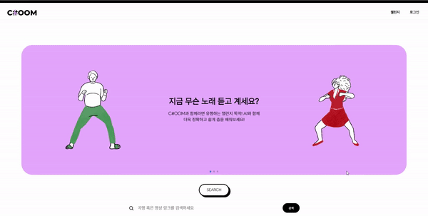
    
- 인기 챌린지 - 마우스 오버시 재생
    
    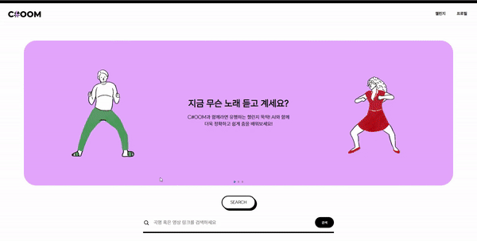
    
- 키워드 및 유튜브 쇼츠 url로 바로 검색 가능
    
    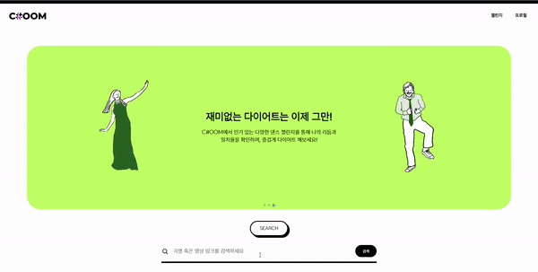
    
    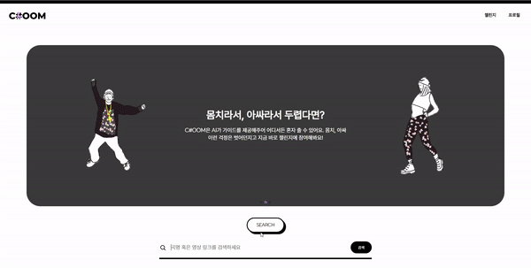
    
- 쇼츠 url 아닐 시 에러 메시지 표시
    
    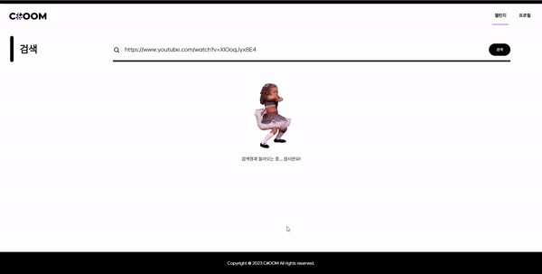
    
 

### 2. 상세 페이지

- 원본 영상 및 상세 정보 확인
- 즐겨찾기
- 해당 영상을 연습한 유저 랭킹 확인 및 간단한 프로필 정보 확인
    - 유튜브 링크 공유시 확인 가능
    
    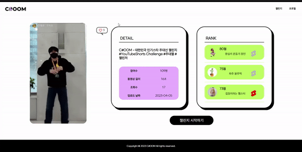
    
 

### 3. 검색 페이지

- 키워드 및 쇼츠 url로 검색 가능
- 최근 검색어 자동 저장 및 삭제
- DB에 학습된 영상 강조 표시, 추가로 유튜브 조회수 상위 기준으로 표시
    
    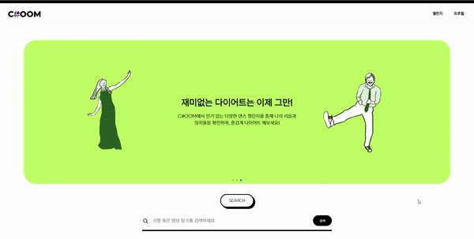
    
 

### 4. 연습 페이지

- 재생 속도, 좌우 반전, 음량 조절, 카메라 변경, 타이머 기능 제공
- 초보자를 위한 가이드 ON / OFF 기능
- 실시간으로 점수 계산하여 화면에 표시
    
    
    
 

### 5. 결과 페이지

- 일치율 점수 확인
- 일치율 그래프에서 시간 클릭시 해당 영상 시간으로 이동하여 확인
- 일치율 가장 높은 구간이 썸네일로 저장
- 제목 편집
- 카카오톡, 유튜브 소셜 공유
- 영상 다운로드 및 삭제
    
    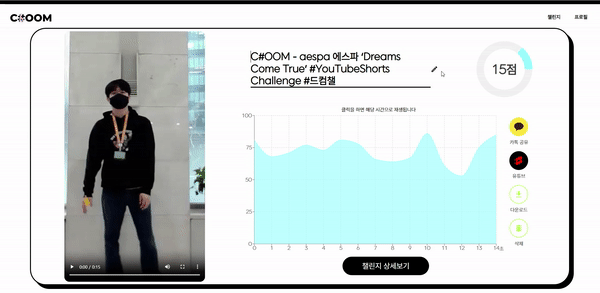
    
 

### 6. 프로필 페이지

- 연습한 영상 점수별, 업로드 날짜별로 정렬하여 확인
- 즐겨찾기한 영상 확인
- 프로필 편집
- 로그아웃, 탈퇴
    
    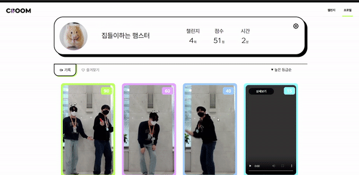
    
 

## 🧱 배포 아키텍쳐

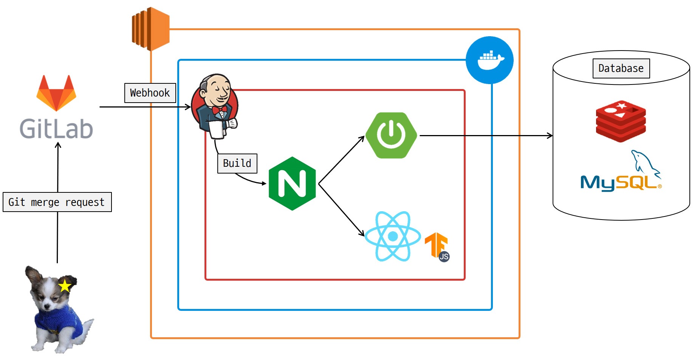

 

## 💾 데이터 플로우

### 0. 전반적인 흐름

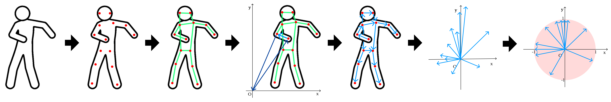

- **BlazePose를 이용해서 동작의 keypoints 추출 → 전처리(Resize and Scale, L2 Normalization) → 일치율 계산(Cosine Similarity) → 점수출력**

 

### 1. BlazePose를 이용해서 동작의 keypoints 추출

- **BlazePose Keypoints: Used in MediaPipe BlazePose**
    
    
    
- **실제 keypoints값 예시**
    
    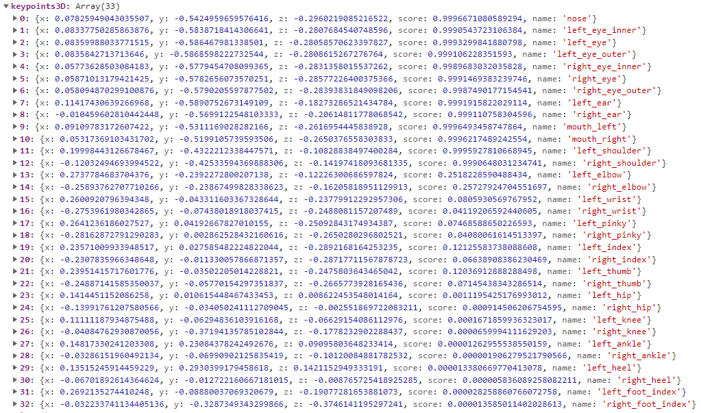
    
 

### 2. 전처리

<aside>
🚫 영상속 사람의 크기가 다르기 때문에 전처리 과정이 필요

</aside>

- **L2 Normalization: 키포인트의 좌표의 모든 벡터가 단위 norm을 갖게한다**
    
    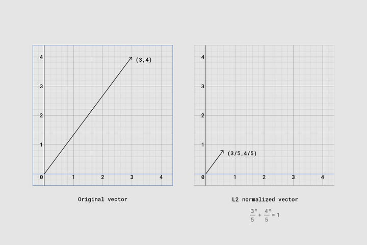
    
                                                                   *A vector scaled with L2 normalization*
    

 

### 3. 일치율 계산

- **정규화된 키포인트 좌표를 통해 Cosine Similarity 계산**
    
    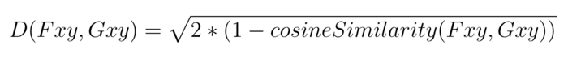
    
- **Cosine Similarity + Confidence Score**
    
    BlazePose를 이용하여 실제 관절이 어디에 있는지 추론할 때, 관절이 어디에 있는지 100% 확신하는 경우는 거의 없습니다. 따라서, 우리는 신뢰도가 낮은 관절이 신뢰도가 높은 관절보다 거리 메트릭에 미치는 영향이 적도록, 관절 데이터에 가중치를 부여할 수 있도록 구글 연구원인 [George Papandreou](https://research.google.com/pubs/GeorgePapandreou.html)와 [Tyler Zhu](https://research.google.com/pubs/TylerZhu.html)는 정확히 위와 같은 작업을 수행할 수 있는 공식을 만들었습니다.
    
    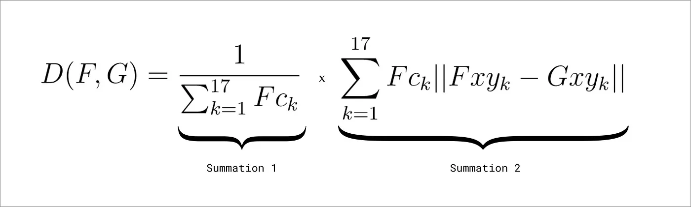
    

### 참조

[Move Mirror: An AI Experiment with Pose Estimation in the Browser using TensorFlow.js](https://medium.com/tensorflow/move-mirror-an-ai-experiment-with-pose-estimation-in-the-browser-using-tensorflow-js-2f7b769f9b23)

[tfjs-models/pose-detection/src/blazepose_mediapipe at master · tensorflow/tfjs-models](https://github.com/tensorflow/tfjs-models/tree/master/pose-detection/src/blazepose_mediapipe)

 

## 📊 ERD 다이어그램

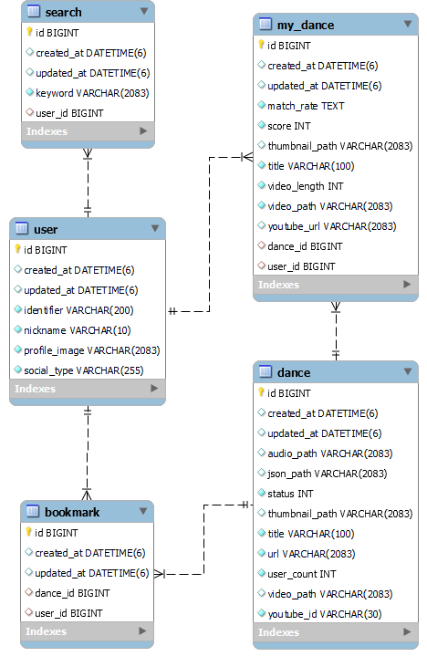

 

## 💬 API 명세서

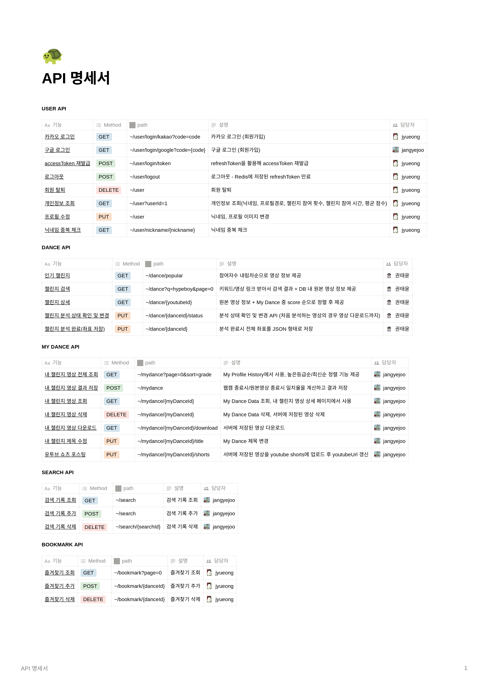

 

## 🖼️ 와이어프레임

